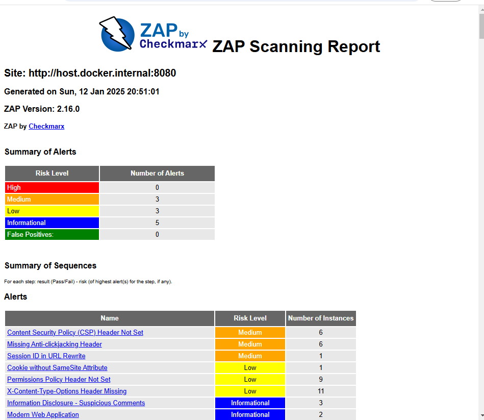

# task4 rozwiazania

## Zadanie 1.

Celem zadania bylo przeprowadzenie testu skanującego obraz dockerowy przy użyciu Trivy oraz zweryfikowanie podstawowych raportów bezpieczeństwa wygenerowanych przez **Trivy**.

w tym celu zbudowano obraz dockerowy aplikacji Java i wykonano jego skanowanie korzystajac z dockerowej wersji skanera Trivy

w wyniku skanowania otrzymano error:
```bash
2025-01-12T18:07:43Z    WARN    Provide a higher timeout value, see https://aquasecurity.github.io/trivy/v0.58/docs/configuration
2025-01-12T18:07:43Z    FATAL   Fatal error     image scan error: scan error: scan failed: failed analysis: analyze error: pipeline error: failed to analyze layer (sha256:9a607d88b5ea6ecf47dbb1d6000b3afd1c88d060f5b7d012280aa6897aeb5b56): post analysis error: post analysis error: walk dir error: context deadline exceeded
```

pomoglo ustawienie parametru `--timeout 10m`
```bash
docker run --rm \
    -v /var/run/docker.sock:/var/run/docker.sock \
    aquasec/trivy image myapp:latest --timeout 10m --format json -o report_trivy.json
```
w efekcie uzyskano rozległy [raport](./raporty/report_trivy.json) z informacja o wykrytych (214) podatnościach 


## Zadanie 2.

Celem drugiego zadania bylo zapoznanie sie z narzedziem **Semgrep** do statycznej analizy kodu (SAST) oraz weryfikacja w jaki sposób może on wykrywać potencjalne błędy i podatności w kodzie źródłowym.

uruchomiono Semgrep lokalnie w dockerze 
```bash
docker run --rm \
    -v "$(pwd)":/src \
    returntocorp/semgrep semgrep scan  --output report_semgrep.json --json
```
w efekcie otrzymano [raport](./raporty/report_semgrep.json): `Ran 445 rules on 1796 files: 26 findings`
## zadaie 3.

W tym zadaniu należało zbudować kompletny proces **CI/CD** w GH Actions lub GitLab CI, ktory
- wykonuje skanowanie obrazu kontenerowego (lub zaleznosci kodu) za pomocą Trivy
- przeprowadza SAST z wykorzystaniem Semgrep 

w celu automatyzacji testow bezpieczenstwa w ramach procesu CI


zadanie wykonano poprzez utworzenie pliku workflow w repozytorium GH w katalogu `./github/workflows/`

przykładowo:
```yaml
name: Security Scan

on:
  push:
    branches: [ "main" ]
  pull_request:
    branches: [ "main" ]

jobs:
  security-tests:
    runs-on: ubuntu-latest

    steps:
      - name: Check out code
        uses: actions/checkout@v2

      - name: Build Docker image
        run: |
          docker build -t myapp:latest .

      - name: Run Trivy scan
        uses: aquasecurity/trivy-action@0.29.0
        with:
          image-ref: 'myapp:latest'
          vuln-type: 'os,library'
          format: 'table'

      - name: Install Semgrep
        run: |
          sudo pip install semgrep --ignore-installed rich

      - name: Run Semgrep SAST
        run: |
          semgrep --config p/security-audit --error --json .
```
powyzszy przykład:
- budujemy obraz dockera myapp:latest
- uruchamiamy skan z użyciem Trivy (action trivy-action)
- instalujemy i uruchamiamy Semgrep

alternatywnie, dla GitLabCI należałoby utworzyć plik `.gitlab-ci.yaml` w repozytorium GitLab CI. Przykładowy plik:
```yaml
stages:
  - build
  - security

build_job:
  stage: build
  script:
    - docker build -t myapp:latest .

trivy_scan:
  stage: security
  image: docker:stable
  services:
    - docker:dind
  script:
    - apk add --no-cache curl
    - curl -sfL https://raw.githubusercontent.com/aquasecurity/trivy/main/contrib/install.sh | sh -
    - ./trivy image myapp:latest

semgrep_scan:
  stage: security
  image: returntocorp/semgrep
  script:
    - semgrep --config p/security-audit --error --json .
```
tym razem
- w etapie "build" budujemy obraz Dockera
- w etapie "security" uruchamiamy skanowanie Trivy i Semgrep

**link do zadania (CI/CD job) które sie wykonało i pokazało wynik testów**:  https://github.com/mrospond/task4/actions/runs/12736515532/job/35496485443


## zadanie 4.
ostatnie zadanie polegało na zweryfikowaniu dynamicznego bezpieczeństwa aplikacji uruchomionej w kontenerze, poznaniu narzędzia OWASP ZAP w trybie automatycznego skanowania (ZAP auto scan) oraz porównaniu wyników DAST (ZAP) z wynikami SAST (Semgrep) i SCA (Trivy)

W tym celu, w dockerze uruchomiono aplikację Java (utworzony wczesniej obraz myapp:latest), po czym uruchomiono OWASP ZAP z obrazu dockera

```bash
docker run -u zap -p 8089:8081 -v $(pwd):/zap/wrk/:rw -i zaproxy/zap-stable zap-baseline.py \
  -t http://host.docker.internal:8080 \
  -r zap_report.html
```

po zakończeniu skanowania ZAP wygenerował [raport](./raporty/zap_report.html) ze znalezionymi podatnościami.



W porównaniu ze wcześniej testowanymi skanerami, tj. SAST (Semgrep) i SCA (Trivy), DAST (OWASP ZAP) wykrył podatności takie jak: CSP Header Not Set, Missing Anti-clickjacking Header, Session ID in URL Rewrite, Cookie without SameSite Attribute, Permissions Policy Header Not Set, X-Content-Type-Options Header Missing itd.

Wyniki SAST, SCA, DAST różnią się miedzy soba - wynika to z techniki wykonywania skanu. Kazde z tych narzedzi bada inne aspekty bezpieczenstwa aplikacji

SAST skupia się na analizie kodu źródłowego, implementowanej logiki, configów, bibliotek, zabezpieczeń ale nie testuje rzeczywsitego działania aplikacji (w czasie rzeczywistym)

SCA skupia się jedynie na zależnościach i komponentach zewnetrznych (wyszukiwanie znanych podatnosci w bibliotekach, itd), tj. wersje bibliotek i obrazy kontenerów

DAST uzupełnia SAST i SCA, wykrywając podatności niewidoczne w kodzie źródłowym lub zależnościach. Skupia się na dzialajacej aplikacji i wykrywa podatnosci w czasie rzeczywistym. 